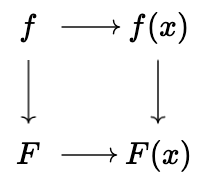
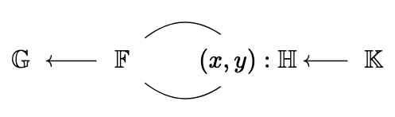

We've completed an initial implementation of the [Golden protocol](https://eprint.iacr.org/2025/1924),
which lets you perform a DKG in just a single round.
Going from two rounds to just one is a huge improvement in simplicity
and performance.
Even with our relatively unoptimized initial implementation,
a dealer with $n = 8$ players finishes its contribution in about
**35 seconds**, players verify it in **1.8 seconds**, and the entire
dealing fits in just **5 KB** (see the [Performance](#performance)
section for more numbers and projections out to $n = 64$).
In this post, we'll go into how this protocol works, at a high level.

# What a DKG needs to do

A threshold secret sharing scheme distributes a secret key among $n$ players,
such that any $t$ of them can reconstruct the key.
[Shamir's secret sharing](https://dl.acm.org/doi/10.1145/359168.359176) uses polynomials to accomplish this.
Our secret $s : \mathbb{F}$ is shared using a polynomial $f$ of degree $t - 1$,
by setting $f(0) = s$, and setting each player's share to $s_i := f(x_i)$.
One choice of the $x_i$ evaluation points would be $1, 2, \ldots$, but any
distinct non-zero points work.

For reconstruction, we rely on the property that given any $t$ points $p_i$,
the values $f(p_i)$ determine $f$ completely.
In fact, given any large enough subset of the $n$ players, each player
can *locally* convert their share $s_i$ into a share $s'_i$, such that:

$$
\sum_{i \in P} s'_i = s
$$

How exactly this reconstruction works isn't essential for this post; we just
care about what the sharing looks like.

## Distributing the Key Generation

To get these shares, we could simply have a dealer generate $f$, calculate $f(x_i)$,
and then send those shares to each player.
The fundamental problem here is that we need to trust this dealer completely:
they know the secret key, and we need to trust them to not use it.

A better approach is to require contributions from several dealers, that
way we only need to trust one of them.
Each dealer generates their own $f_j$, $s_{ij} := f_j(x_i)$, and then each player's
share is:

$$
s_i := \sum_j s_{ij} = \sum_j f_j(x_i)
$$

One neat fact about polynomial evaluation is that $(f + g)(x) = f(x) + g(x)$,
so each player's share is in fact:

$$
s_i := \left(\sum_j f_j\right)(x_i)
$$

so, we still have the nice property that there's a shared polynomial, as if
a single dealer had generated the polynomial.

There are some other details that aren't too important to us, like how you
don't need to include every dealer, depending on your trust assumptions,
and how you can preserve the value of $f(0)$ across multiple rounds, so that
the secret stays static.

One important detail we are failing to consider is what malicious dealers
can do.
What happens if a dealer sends $s_{ij}$ values which don't come from evaluating
a single polynomial, or from using the wrong evaluation points?
Then, our shared secret would not have the right structure, and we would not
be able to use it in the way we expect.

Let's look at how to address this.

# The Two Round Approach

The "standard" approach, which we use today (see
[Pedersen](https://link.springer.com/chapter/10.1007/3-540-46766-1_9) and
[Gennaro, Jarecki, Krawczyk, Rabin](https://link.springer.com/article/10.1007/s00145-006-0347-3)),
involves adding an additional
round to the DKG, in order to let players "complain" about the shares they've received.

From here on out, we assume that $\mathbb{F}$ is the scalar field of some cryptographic group
$\mathbb{G}$ of prime order, generated by $G$.

This lets a dealer send $F_j := f_j \cdot G$ publicly (we define $F_j$ to be a polynomial
with coefficients in $\mathbb{G}$, produced by acting on $G$ with each coefficient),
as in [Feldman's verifiable secret sharing](https://ieeexplore.ieee.org/document/4568297).
This enables every player to check their own share, via:

$$
f_j(x_i) \cdot G \overset{?}{=} F_j(x_i)
$$

This works because multiplying by $G$ commutes with evaluating the polynomial:

Players can thus send acks only for dealers whose shares they've checked.
Dealers can collect these signed acks, and use them as social proof that
their shares were generated correctly.
This allows players to include only those dealers that have been acked by
the other players.

But, what if the players are malicious?
What if a player has a perfectly good share, but refuses to ack?
In that case, the dealer needs a way to defend themselves.
They can do this by revealing $f_j(x_i)$ for the $i$-th player refusing
to ack.
The other players will then be able to check that $f_j(x_i) \cdot G \overset{?}{=} F_j(x_i)$
themselves.
This weeds out bad dealers, who will not get enough acks, but also prevents
malicious players from falsely accusing a dealer.

There are a few annoyances with this approach though.

The security of the protocol relies on assumptions about the number of corruptions.
Malicious players can lie and refuse to ack perfectly valid shares, forcing us
to reveal them.
We need to make assumptions about how many players might lie, in order to try
and reject dealers with too many revealed shares.
We also need to make assumptions about how many players are honest to define
what a sufficient number of acks are.

The biggest annoyance however comes with the timing assumptions inherent here.
Even after we see the contribution of a dealer, we need to wait long enough
to allow players to submit their acks.
Malicious players can be disruptive by not submitting anything here,
so we need some kind of cutoff point in order to choose to reveal their share,
but we don't want to set it so tightly that honest players don't have enough
time to ack.
Naively, this kind of clocked protocol forces us into a synchronous model of execution,
which we usually try to avoid, because assuming realtime execution is quite unrealistic.

In practice, you can improve the situation by tying the clock to a consensus protocol,
e.g. waiting a certain number of *blocks* rather than a certain amount of time.
It's possible that this is correct in the
[partial synchrony model](https://eprint.iacr.org/2023/1196) as well.

Multiple rounds are also operationally complicated.
The protocol is stateful between the rounds.
Players need to remember what shares they received, and what they did or didn't
ack.
We rely on private out-of-band communication for those shares, rather than a public
log of messages.
This makes recovering from failure during the protocol a lot harder, which just increases
the operational complexity of the whole system.
The uncertainty about time also makes it hard to run the protocol very fast.
Even if there's not much computation, you need to add in large time buffers
for safety, and these buffers are just idle time.

# The One Round Approach

Imagine that instead of requiring private communication, multiple rounds,
and assumptions about malicious thresholds, we could instead have a simple protocol,
where each dealer posts a public message, which:

- allows the intended recipient to obtain their share,
- hides this share from anyone else,
- convinces everybody that all these shares are correct.

This would address the issues we had with the two round approach.
We wouldn't need any state at all: if we lost our memory completely,
we would be able to retrieve our share and any public results just by
looking at the log, which contains what each dealer posted.

The protocol can proceed immediately after the dealers have posted their logs,
without needing to wait for acknowledgments from the players.
This lets us avoid any kind of synchrony assumption.
In practice you would want to set a cutoff time (in terms of blocks, ideally),
and would need to make sure that you had a supermajority of valid contributions,
in order to prevent stalling by having malicious dealers withhold their contribution.

There's also no need to reason about malicious players in this scheme: because
dealer contributions are *publicly verifiable*, anyone can check that each
dealer did the right thing, and you just need $t$ valid contributions, to
ensure that you can't create signatures with too few signers.

Another advantage is that with one round, it would be easy to pro-actively
refresh shares.
It would be easy for a dealer to include shares, from a polynomial where $f(0) = 0$,
and these could be added to the shares people have currently.
Since anyone could verify that the shares were computed correctly after the dealer
posts their message, the refresh could be tightly integrated with the consensus protocol.

How do we achieve this though?
Naively, we could use a public key encryption scheme, include a ciphertext
containing each participant's share, and then use a Zero-Knowledge (ZK) proof
to show that each share is an encryption of $f_j(x_i)$, and $f_j$ corresponds
to the public polynomial $F_j$ we're including in our contribution.
This is essentially the approach taken by prior non-interactive constructions
such as [Groth's DKG](https://eprint.iacr.org/2021/339), which uses ElGamal
encryption together with a NIZK of correct encryption.
That achieves the properties we want, but would involve a ZK proof
over an excessively large statement.
This naive approach would be impractical for hundreds of validators,
so we need to dig a bit deeper.

# Making this more efficient

Treating encryption as a black box and doing a full ZK proof is always going
to result in an inefficient system.
To improve on this, we can figure out exactly what our encryption needs
to do, and prove as little as necessary about it.

It turns out that we don't need a full encryption scheme.
Imagine if the dealer $j$ and the player $i$ had a shared mask $m_{ij}$.
Then, the dealer could include $c_{ji} := s_{ji} + m_{ij}$.
If other participants don't know this mask, and it's only used once,
then we can safely include $c_{ji}$ as the ciphertext.

How do we establish a shared mask between a dealer and a player though?
A natural primitive here is a key exchange.
We have a function $\text{ke}$, taking in one secret key, one public key,
and a message, such that:

$$
\text{ke}(\text{sk}_i, \text{Pk}_j, \text{msg}) = \text{ke}(\text{Pk}_i, \text{sk}_j, \text{msg})
$$

In other words, given one of the secret keys, you can compute the key exchange value,
getting the same random mask as your counterparty.
Without either secret key, this value looks completely random, and we can even
include a message which should also affect the output.
By choosing a random message for each new DKG, we can make each output fresh.

This scheme also suggests a natural way of checking the correctness of $c_{ji}$:

$$
c_{ji} \cdot G = s_{ji} \cdot G + m_{ij} \cdot G = f_j(x_i) \cdot G + m_{ij} \cdot G
\overset{?}{=} F_j(x_i) + m_{ij} \cdot G
$$

If we had access to $M_{ij} := m_{ij} \cdot G$, then we could perform this check,
allowing us to make sure that each share is masked correctly.
Instead of doing a ZK proof for a full encryption, we could just do a proof
for the relation:

$$
\left\{ (M_{ij}, \text{Pk}_i, \text{Pk}_j) ; (\text{sk}_j, m_{ij}) \mid
M_{ij} = m_{ij} \cdot G \land m_{ij} = \text{ke}(\text{Pk}_i, \text{sk}_j) \land
\text{Pk}_j = \text{sk}_j \cdot G \right\}
$$

i.e. that $M_{ij}$ commits to the "correct" mask derived from the dealer's
secret key and the player's public key.

So, what we need is a random function that either the dealer or the player
can compute, which can also be publicly verified.
The jargon here is a ["verifiable random function" (VRF)](https://ieeexplore.ieee.org/document/814584).
One way to construct one of these is using a Diffie-Hellman exchange:

$$
H(\text{sk}_i \cdot \text{Pk}_j, \text{msg}) =
H(\text{sk}_j \cdot \text{Pk}_i, \text{msg})
$$

We can hash the result of a DH exchange, along with the message, and get
a random output, that either the dealer or player can compute.
We can then do a generic ZK proof to show that:

$$
M_{ij} = H(\text{sk}_j \cdot \text{Pk}_i, \text{msg}) \land \text{sk}_j \cdot G = \text{Pk}_j
$$

In other words, this specific dealer correctly computed the mask, which $M_{ij}$
commits to.
From there, we can check the share without needing any further proofs.

Naturally, doing this generically would be too expensive, so we need to be
a bit clever.

ZK proofs are usually based on an arithmetic circuit.
The proof system has a typical field it works over,
with addition and multiplication in this field forming the basic operations
you need to define your computation with.
In our case, since $H$ outputs a mask in $\mathbb{F}$, it's natural for $\mathbb{F}$
to be the field we use for our computation.
This means that $H$ needs to be defined in this field, and that the group
we use for the DH exchange needs to be easily computable in this field.
To do that, it's natural to pick an elliptic curve whose coordinates
are elements of $\mathbb{F}$.
Let's call this $\mathbb{H}$.
The situation is that we have:

- DKG group $\mathbb{G}$, scalar field $\mathbb{F}$,
- DH curve $\mathbb{H}$ with coordinates in $\mathbb{F}$, and scalar field $\mathbb{K}$.

Or, in a diagram:

In other words, $\mathbb{H}$ is a curve "over" the group $\mathbb{G}$.
Concretely, for the case of [BLS12-381](https://electriccoin.co/blog/new-snark-curve/),
there's a curve called ["Bandersnatch"](https://eprint.iacr.org/2021/1152)
defined over its scalar field, that we can use.

Because the curve is naturally defined over the native field of our circuit,
doing curve operations is relatively easy.
Because of this, we want to also use the curve for doing the hash function.
We can define:

$$
H(P, \text{msg}) := x(x(P) \cdot H_1(\text{msg})) + \beta x(x(P) \cdot H_2(\text{msg}))
$$

where $x$ is the function getting the x coordinate of an elliptic curve point.
Because this curve is defined over $\mathbb{F}$, this is simply an $\mathbb{F}$
element.
We also abuse notation a bit, and do $x(P) \cdot Y$, to mean decomposing $x(P)$
into bits, and doing a scalar multiplication.
We also need $H_1, H_2 : \text{msg} \to \mathbb{H}$, two different hash-to-curve
functions.
These should produce a random element on the curve, without us learning
its discrete logarithm.
Because these functions are run on the public value $\text{msg}$,
we don't actually need to compute them in circuit.
We can instead compute them ourselves, and supply them as input to the circuit.
This trick lets us defer the hard work of hashing the message outside of the proof.

Putting everything we need to prove together, we get:

$$
\text{sk}_j \cdot G = \text{Pk}_j \land P = \text{sk}_j \cdot \text{Pk}_i \land
m_{ij} = H(P, \text{msg}) \land M_{ij} = m_{ij} \cdot G
$$

Where $\text{Pk}_i, \text{Pk}_j, M_{ij}, H_1(\text{msg}), H_2(\text{msg})$
are all public inputs to the proof.
All of these operations are nice and native, *except* for that last one,
the $m_{ij} \cdot G$.
While $m_{ij}$ is our native field element $\mathbb{F}$, $G$ is in $\mathbb{G}$,
and not $\mathbb{H}$!
Because of this, we can't natively prove that this multiplication
is correct as easily.

While it would be possible to emulate this, at a cost, we can actually
get around this requirement entirely by using a specific proof system.
If we use [Bulletproofs](https://eprint.iacr.org/2017/1066), we actually get the nice property, for free,
that if you want to prove:

$$
f(a_0, \ldots) \land \forall i, a_i \cdot G = A_i
$$

then you don't actually need to prove anything about the $a_i \cdot G$ part,
only the relation $f$.
Intuitively, this works because Bulletproofs is natively about proving
that something holds for the values that the $A_i$ commit to,
so we get the fact that $A_i = a_i \cdot G$ for free,
and we just need to pay for whatever we want to prove about $a_i$.
In our case, we want to prove that the mask was computed by doing the VRF.

# A small ZK stack

So, to implement all of this, we needed to:

- implement the Bandersnatch curve over BLS12-381,
- implement Bulletproofs,
- implement the specific circuit we need for Golden.

For the first and third item, we leaned on the [arkworks ecosystem](https://arkworks.rs),
for quick prototyping.
There was an existing Bandersnatch implementation that we were able to use.

Unfortunately, there wasn't an existing Bulletproofs implementation that would
work in our case, so we ended up doing that ourselves.
The crux of this proof system is that you have:

$$
P = \langle a_i, G_i \rangle + \langle b_i, H_i \rangle
$$

and you want to prove that:

$$
\langle a_i, b_i \rangle = c
$$

This kind of proof is called an "inner product argument".
Bulletproofs also reduces an arithmetic circuit, in the form of R1CS,
into this argument, through some interaction between the prover and verifier,
which we can make non-interactive, replacing the verifier's challenges with
a hash function.

The important thing to note, however, is that this core inner product argument
is what determines the cost of the verification.
We get $O(\text{lg} n)$ proof sizes ($n$ being the number of multiplications in our circuit),
and $O(n)$ verifier time, which consists of a Multi-Scalar Multiplication (MSM)
of size $O(n)$.
What's neat about this system is that it's very amenable to batch verification.
We can verify many proofs with a single MSM of size $O(n)$,
which in practice makes it so that each additional proof is no less expensive.

We also use batching in the prover, but to less effect.
By having the prover show that *all* of the masks they produced are correct,
we get $O(\text{lg}(m n))$ proof sizes instead of $O(m \cdot \text{lg} n)$,
which we would have if we did one proof per mask.
This does come at the cost of having $O(m n)$ verification time though.
Thankfully, because of batching, we only pay the cost of verifying the proof
of a single dealer, which is quite nice.

# Performance

Here are the current performance numbers we have from our initial implementation.
Measured values are taken from `bls12381::golden_dkg::{deal, verify, dealing_size}`
for $n \in \{2, 4, 8\}$; values for $n \in \{16, 32, 64\}$ are projected linearly
(shown in gray) since the underlying cost is dominated by $O(n)$ work.

| $n$ | Deal time | Verify time | Dealing size |
|----:|----------:|------------:|-------------:|
|   2 | 8.86 s    | 534 ms      | 2,903 B      |
|   4 | 17.56 s   | 956 ms      | 3,655 B      |
|   8 | 34.78 s   | 1.76 s      | 5,111 B      |
|  16 | ~69.7 s  | ~3.40 s  | ~8,055 B  |
|  32 | ~139 s   | ~6.67 s  | ~13,943 B |
|  64 | ~278 s   | ~13.2 s  | ~25,719 B |

There's still some room for improvement, e.g. by using a more efficient circuit,
and avoiding the overhead from converting between Arkworks's R1CS representation
and what Bulletproofs needs.
Even with the current numbers, this would still be an attractive protocol.
Even though the dealer takes a lot of time,
because you don't need to wait for acks, in practice this would be a lot faster.

# Conclusion

We'll continue grinding on the performance, as well as testing and
verifying the security of our implementation, in order to make this protocol
a trustworthy alternative to our current DKG.
We expect that the one round protocol will be a lot simpler to use,
and are excited for what applications people will cook up with it!
Stay tuned for more blog posts as we dig into optimizations!
