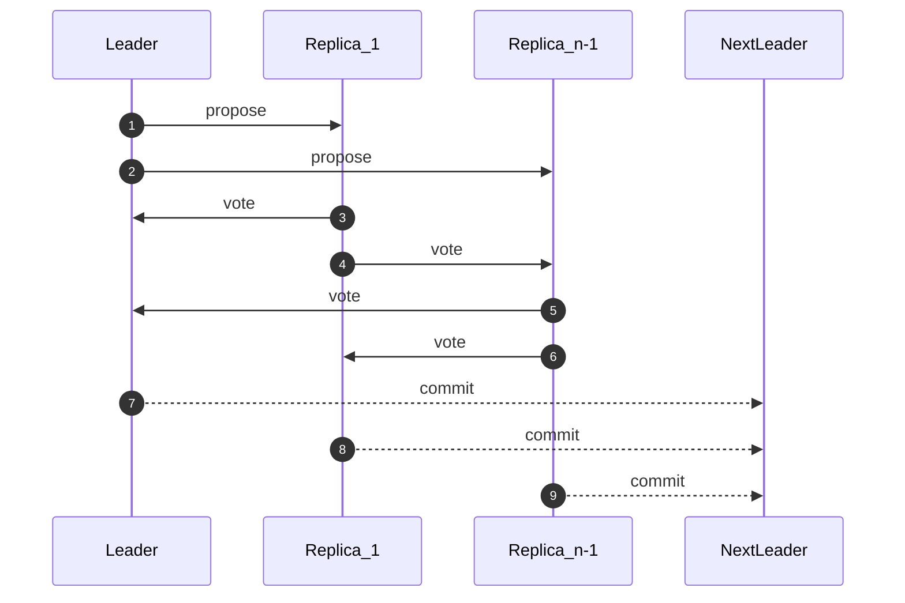
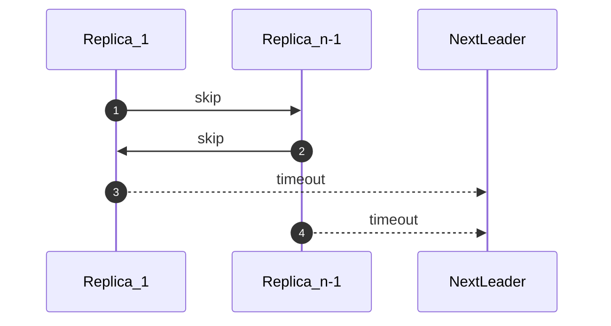
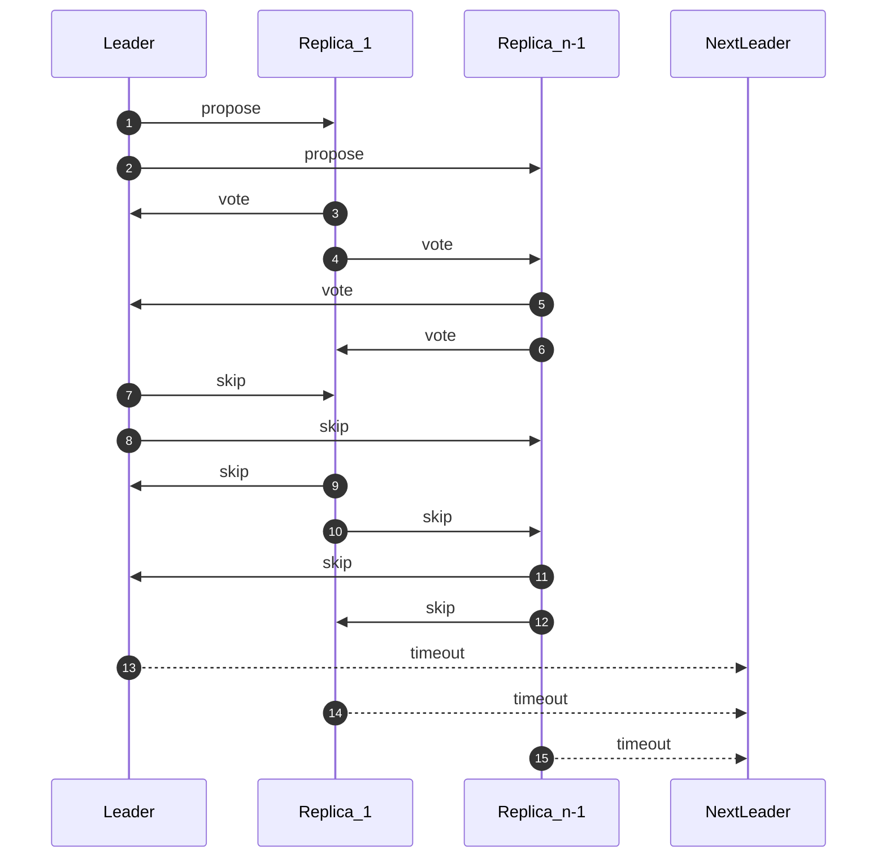

# Specification

## 1. Model & Parameters

- Replicas: n = 5f + 1
- Byzantine replicas: ≤ f
- Partial synchrony: after an unknown GST every message arrives within Δ.
- Ancestry: a ≺ b means "a is an ancestor of b"; ⊥ ≺ x for every block x.

## 2. Message Types

| Message | Purpose |
|---------|---------|
| `propose(c, v, proof)` | Leader's proposal for view `v`; `proof` is a `commit` or a `timeout` from `v - 1`. |
| `vote(c, v)` | Vote for block `c` in view `v`. |
| `skip(v, lock)` | Replica declines to vote in `v`; carries its current `lock`. |
| `commit(c, v)` | Certificate of ≥ `Q` votes for `(c, v)`. |
| `timeout(v, {skip(v, ·)})` | Certificate of ≥ `Q` `skip` messages in view `v`. |

## 3. Quorums

- `Q = n - f` (≥ `4f + 1`). Two `Q`-sets intersect in ≥ `3f + 1` replicas (≥ `2f + 1` honest).
- `L = n - 3f` (≥ `2f + 1`). A timeout that co-exists with a commit must contain ≥ `L` votes for that commit's block.

## 4. Replica State (initial)

```text
view         = 0
lock         = ⊥            # highest (block, view) this replica voted for
skipped      = ⊥            # highest view this replica skipped
last_commit  = commit(⊥, 0) # seeded with genesis
last_timeout = ⊥
```

## 5. Helpers

```text
leader(v):
    return (v % n)

find_lock(timeout):
    if timeout == ⊥:
        return ⊥
    if some block c has ≥ L votes in timeout:
        return c
    return ⊥
```

## 6. Protocol for View `v`

### 6.1 Entering view `v`

1. `l = leader(v)`. Start timers:
   - `t_l = 2Δ`
   - `t_a = 3Δ`.
2. If `self == l`:
   - If `v == last_commit.view + 1`:
     1. Build a child `c` of `last_commit`.
     2. Broadcast `propose(c, v, last_commit)`.
   - Else if `v == last_timeout.view + 1`:
     1. `c = find_lock(last_timeout)`; if `c == ⊥`, `c = child(last_commit)`.
     2. Broadcast `propose(c, v, last_timeout)`.

### 6.2 Receiving `propose(c, v, proof)` from `l`

1. Update state:
   - If `proof` is a newer commit: `last_commit = proof`.
   - If `proof` is a newer timeout: `last_timeout = proof`.
2. **Drop** the proposal if `lock.view == v` (already voted) or `skipped == v` (already skipped).
3. Cancel `t_l`.
4. Vote for `c` iff:
   1. `last_commit ≺ c`, and
   2. one of:
      - `v == last_commit.view + 1`, or
      - `v == last_timeout.view + 1` and (`find_lock(last_timeout) == ⊥` **or** `c == find_lock(last_timeout)`).
   3. `c` passes verification.
5. If voting:
   - `lock = (c, v)`.
   - Broadcast `vote(c, v)`.

### 6.3 Timer expiry (`t_l` **or** `t_a`)

1. If `skipped == v`: **drop**.
2. `skipped = v`.
3. Broadcast `skip(v, lock)`.

### 6.4 Assembling / Receiving `commit(c, v)`

- On observing `≥ Q` `vote(c, v)` messages: assemble `commit(c, v)` and forward it to the next leader.
- Upon a valid `commit(c, v)`:
  1. Cancel timers.
  2. `last_commit = commit(c, v)`.
  3. If `commit.view >= lock.view`: `lock = ⊥`.
  4. `view = v + 1`.

_`propose(c, v, timeout)` counts as a leader `l`'s `vote(c, v)`._

### 6.5 Assembling / Receiving `timeout(v, {skip(v, ·)})`

- On observing `≥ Q` `skip(v, ·)` messages: assemble `(timeout(v, {skip(v, ·)}), last_commit)` and forward it to the next leader.
- Upon a valid timeout certificate:
  1. Cancel timers.
  2. `last_timeout = timeout(v, {skip(v, ·)})`.
  3. `view = v + 1`.

## 7. Intuition

- A `timeout(v,{skip(v,·)})` **without** any block that has `L` votes proves that no `commit` was possible in view `v`. In `v + 1` replicas may therefore vote for *any* block that merely extends `last_commit`. If the timeout instead shows **≥ L but < Q** votes for some block `c`, a `commit(c,v)` **might** exist, so leaders must keep re-proposing `c` until it either commits or a later timeout contradicts it.
- If multiple such timeouts exist and each carries a (possibly different) block with `≥ L` votes, a leader in view `v + 1` may re-propose **any** of those blocks; the fact that two different blocks have `L` votes implies that neither could have reached `Q` votes (hence no commit yet).
- The only long-lived piece of local state is the `lock`. A replica abandons its lock **only** when shown proof—via a `commit` or an appropriate `timeout`—that the locked view cannot contain a committed block.
- Suppose a correct leader broadcasts a block `c` and, just after all replicas vote, the network partitions. Replicas will gather `Q` `skip` messages and advance, perhaps unaware that `c` already has `Q` votes. This is safe: any resulting timeout must still include `≥ L` votes for `(c,v)`, forcing the next leader to re-propose `c` until it commits.
- A Byzantine leader could equivocate, sending a distinct proposal to each replica and causing them to lock on different blocks. Nonetheless, any timeout they create will lack a block with `L` votes, so replicas will freely vote in the next view for extensions of `last_commit`, ignoring their conflicting locks when justified.


## 8. Message Complexity

This section counts **point-to-point** messages; a logical broadcast to all replicas is tallied as `(n - 1)` individual transmissions.  We ignore block data size and focus only on control messages (`propose`, `vote`, `skip`, `commit`, `timeout`).

### 8.1 Honest leader

| Role | Sent | Received | Approximate |
|------|------|----------|-------|
| Leader | `propose` x `(n - 1)` + `commit` x `1` | `vote` x `(n - 1)` | `2n` |
| Next Leader | `vote` x `(n - 1)` | `propose` x `1` + `vote` x `(n - 2)` + `commit` x `(n - 1)` | `3n` |
| Other | `vote` x `(n - 1)` + `commit` x `1` | `propose` x `1` + `vote` x `(n - 2)` | `2n` |

**Total (Approximate):** `(n - 1)` `propose` + `(n - 1)(n - 1)` `vote` + `(n - 1)` `commit` = `n^2 + 2n`



### 8.2 Offline leader

| Role | Sent | Received | Approximate |
|------|------|----------|-------|
| Next Leader | `skip` x `(n - 1)` | `skip` x `(n - 1)` + `timeout` x `(n - 1)` | `3n` |
| Other | `skip` x `(n - 1)` + `timeout` x `1` | `skip` x `(n - 1)` | `2n` |

**Total (Approximate):** `(n - 1)(n - 1)` `skip` + `(n - 1)` `timeout` = `n^2 + n`



### 8.3 Unstable Network

| Role | Sent | Received | Rounded |
|------|------|----------|-------|
| Leader | `propose` x `(n - 1)` + `skip` x `(n - 1)` + `timeout` x `1` | `vote` x `(n - 1)` + `skip` x `(n - 1)` | `4n` |
| Next Leader | `vote` x `(n - 1)` + `skip` x `(n - 1)` | `propose` x `1` + `vote` x `(n - 2)` + `skip` x `(n - 1)` + `timeout` x `(n - 1)` | `5n` |
| Other | `vote` x `(n - 1)` + `skip` x `(n - 1)` + `timeout` x `1` | `propose` x `1` + `vote` x `(n - 2)` + `skip` x `(n - 1)` | `4n` |

**Total (Approximate):** `(n - 1)` `propose` + `(n - 1)(n - 1)` `vote` + `(n - 1)(n - 1)` `skip` + `(n - 1)` `timeout` = `2n^2 + 2n`



## 9. Dialects

* **Slow Path Fallback:** [Alpenglow](https://drive.google.com/file/d/1y_7ddr8oNOknTQYHzXeeMD2ProQ0WjMs/view), [Kudzu](https://arxiv.org/abs/2505.08771), and [Hydrangea](https://eprint.iacr.org/2025/1112) propose falling back to a "slow path" (e.g. three-phase commit) if the number of offline replicas is less then some `p` (and/or the sum of byzantine and offline replicas is less than some `k`). While this is a practical adaptation of the consensus problem, it carries with it the complexity of having to ensure voting between the "fast path" and "slow path" is consistent and, in some schemes, the message complexity of running multiple consensus processes concurrently in a single view.
* **Productive Timeouts:** A malicious leader might only send block `c` to `2f + 1` honest replicas in view `v`, forcing the leader of `v + 1` to re-propose `c` (revoking their right to propose a unique block). [Hydrangea](https://eprint.iacr.org/2025/1112) proposes a mitigation to this attack, allowing the next leader to propose some *descendant* of a block with `≥ L` votes in a `timeout`, rather than just re-proposing the same value. This tweak requires voters to perform a common ancestry check on last votes in `timeout` to determine the last common ancestor they can build on some view `v + k`, logic that can be expensive to run in practice especially in the presence of equivocating leaders (requires tracking the ancestry of all `vote` messages). When paired with [Autobahn](https://arxiv.org/abs/2401.10369)-style execution certificates, forced re-proposal is less of a concern as transaction ordering can continue regardless of commit progress (jumping to latest in the first view where an honest leader can propose a unique block).
* **Fast Recovery:** Unlike [Simplex](https://eprint.iacr.org/2023/463), replicas forward `commit(c,v)` or `(timeout(v,{skip(v,·)}),last_commit)` **only** to the next leader. To reduce the worst-case recovery latency after GST (where the next leader is not aware of the highest commit held by any correct replica), replicas can broadcast `last_commit` anytime they enter a new view (with multi-signature or threshold signature certificates, this is negligible overhead).
* **VRF Leader Election and Threshold Certificates:** Like [threshold-simplex](https://docs.rs/commonware-consensus/latest/commonware_consensus/threshold_simplex/index.html) did for [simplex](https://docs.rs/commonware-consensus/latest/commonware_consensus/simplex/index.html), this specification can be extended to support both VRF leader election and threshold certificates with `vote` and `skip` partial signatures, `Q`-set threshold signatures, and by piggy-backing a partial signature over `view` in both `vote` and `skip` messages (to power a VRF).

## 10. Related Works

- [Fast Byzantine Consensus](https://ieeexplore.ieee.org/document/1467815)
- [Simplex Consensus: A Simple and Fast Consensus Protocol](https://eprint.iacr.org/2023/463)
- [Solana Alpenglow Consensus: Increased Bandwidth, Reduced Latency](https://drive.google.com/file/d/1y_7ddr8oNOknTQYHzXeeMD2ProQ0WjMs/view)
- [Kudzu: Fast and Simple High-Throughput BFT](https://arxiv.org/abs/2505.08771)
- [Hydrangea: Optimistic Two-Round Partial Synchrony with One-Third Fault Resilience](https://eprint.iacr.org/2025/1112)
- [Autobahn: Seamless high speed BFT](https://arxiv.org/abs/2401.10369)

# Appendix: Proof Sketches

## 1. Model & Parameters

- Replicas: n = 5f + 1
- Byzantine replicas: ≤ f
- Partial synchrony: after an unknown GST every message arrives within Δ.
- Ancestry: a ≺ b means "a is an ancestor of b"; ⊥ ≺ x for every block x.

_These are the same as in the specification above but are repeated for completeness._

## 2. Preliminaries

### 2.1 Quorum intersection

For any two `Q`-quorums `|Q₁ ∩ Q₂| ≥ (4f + 1) + (4f + 1) - (5f + 1) = 3f + 1`. Because at most `f` of these replicas are Byzantine, **at least `2f + 1` correct replicas** lie in every intersection.

### 2.2 Voting rules

1. A correct replica votes **at most once per view**.
2. A vote is cast **only** for a block that extends the replica's latest known commit.
3. If a replica is locked on `(c, v)` it keeps that lock until one of the following happens:
   * It sees a commit with `view >= v`, or
   * It enters `v + 1` *and* the accompanying `timeout(v, {skip(v,·)})` either
        - contains **no** block with `L` votes, or
        - contains `c` itself with `L` votes (in which case the replica will only vote for `c`).

### 2.3 Commit monotonicity

If a correct replica commits `c` in view `v`, every later commit is `c` or a **descendant** of `c`.

## 3. Safety

> **Theorem 1 (Safety).** Two conflicting blocks can never both be committed by correct replicas.

### Proof

Assume, for contradiction, that two conflicting blocks `c` and `d` are each committed by some correct replica. Let `v_c` and `v_d` be the views in which they commit and assume without loss of generality that `v_c ≤ v_d`.

#### Case 1: `v_c == v_d`

The two commit certificates are formed from distinct `Q`-quorums in the same view. Because any two `Q`-quorums intersect in at least `2f + 1` correct replicas (§2.1), some correct replica would have had to vote twice in view `v_c`, contradicting the *at-most-one-vote-per-view* rule (§2.2-1). This case is impossible.

#### Case 2: `v_c < v_d`

Pick a correct replica `r` that lies in the intersection of the two `Q`-quorums (it exists by §2.1).

1. `r` voted for `c` in view `v_c` and therefore locked on `(c, v_c)`.
2. For `r` to appear in the commit certificate for `(d, v_d)` it must cast a `vote(d, v_d)`. We rule out that possibility in two steps:

   **Step A — Before `r` leaves view `v_c`.** While still in view `v_c` a correct replica cannot vote in any later view, so it certainly cannot vote for `d` in `v_d`.

   **Step B — After `r` leaves view `v_c`.** A correct replica exits `v_c` in exactly one of two ways:

      * **It observes `commit(c, v_c)`.** Upon seeing this commit, voting rule §2.2-3 restricts `r` to voting only for blocks that extend `c` in every later view. Because `d` conflicts with `c`, `r` cannot vote for `d`.

      * **It observes a `timeout(v_c,{skip(v_c,·)})`.** If such a timeout coexists with `commit(c, v_c)`, quorum-intersection guarantees it carries at least `L` skips whose `lock` field points to `c`. Voting rule §2.2-3 now obliges any replica that held `(c,v_c)`—including `r`—to vote **only** for `c` in view `v_c+1` and thereafter. Again, `r` cannot vote for the conflicting block `d`.

   In both sub-cases `r` is unable to vote for `d` in view `v_d`, so it cannot belong to the commit certificate for `(d, v_d)`.

Since both cases are impossible, two conflicting blocks can never both be committed. ∎

## 4. Liveness

> **Theorem 2 (Liveness).** Once the network is synchronous (all links deliver correct-replica messages within `Δ`), the protocol commits a new block in finite time.

### Proof

We show that after GST there must be a view whose correct leader (i) knows **both** the highest-view `commit` and the highest-view `timeout` held by any correct replica and (ii) proposes a block that *every* correct replica is willing to vote for. That view necessarily ends with a `commit`, proving liveness.

#### Notation

* Let `HC_v` be the highest-view `commit(c,v_c)` known to **any** correct replica when the first correct replica enters view `v`. If no commit is known we set `HC_v = commit(⊥,0)`.
* Let `HT_v` be the highest-view `timeout(v_t,{skip(v_t,·)})` known to **any** correct replica at the same moment. If no timeout is known we set `HT_v = ⊥`.

#### Lemma 1 (Highest-evidence leader)

There exists a view `v*` such that:
1. The leader `ℓ` of `v*` is correct, and
2. When `ℓ` sends some `propose` message in `v*` it holds **both** `HC_{v*}` and `HT_{v*}`.

*Justification.* Once a correct replica assembles a certificate in view `u`, it forwards that certificate (if not replaced with a higher one) to each subsequent leader. After GST, forwarded messages reach all correct replicas — and thus every later leader — within `Δ`. Hence, by the time the system reaches view `u + k`, every correct leader in `k` subsequent views already holds that certificate. Because among any `n` consecutive leaders at least `n - f` are correct, there is a first view whose leader is correct **and** already possesses every certificate known to any correct replica before it broadcasts `propose`. Denote that view by `v*`. ∎

#### Lemma 2 (Universal-voting view)

If the leader `ℓ` of view `v` is correct and holds `HC_v` and `HT_v` when proposing, then all correct replicas cast exactly one vote for `ℓ`'s proposal in view `v`.

*Justification.*  Let `c` be the block that `ℓ` proposes, following the rules in §6.1.

1. Case `HC_v.view ≥ HT_v.view` (the commit is at least as recent as the timeout).
   * Every correct replica has updated `last_commit` to `HC_v` (§6.4). When `HC_v.view ≥ HT_v.view` we have `v = HC_v.view + 1`, so §6.1 obliges the leader to embed **that very commit** in the `proof` field of its `propose` message; §6.2(1) then causes every recipient to set `last_commit = HC_v`.
   * Because `v` equals `last_commit.view + 1`, condition §6.2(4.2) is irrelevant and each replica will vote for the block selected by `ℓ` (as long as it is a child of `HC_v`).
2. Case `HT_v.view > HC_v.view`.
   * By construction `v = HT_v.view + 1`.
   * Let `d = find_lock(HT_v)`.
     - If `d = ⊥`, `ℓ` proposes a child of `last_commit`, satisfying §6.2(4.2) for every replica.
     - If `d ≠ ⊥`, `ℓ` must propose `d`; the same voting rule now forces every correct replica to vote for `d`.

In both cases each correct replica casts exactly one vote and no replica abstains, establishing the claim. ∎

#### Lemma 3 (Commit precedes timeout in view `v*`)

Let `T₀` be the moment the **first** correct replica enters view `v*`.

*Entry deadline.* The correct leader `ℓ` joins within `Δ` of `T₀` and immediately broadcasts `propose(c, v*, ·)` (the proof it includes is irrelevant here). Hence every correct replica both enters `v*` and receives the proposal by `T₀ + 2Δ`.

*Universal voting.*  By Lemma 2 all correct replicas vote exactly once for `c` upon reception. Their votes are issued by `T₀ + 2Δ`.

*Commit before any timeout.* Every correct replica receives `Q` votes by `T₀ + 3Δ`; upon reception each replica **locally** assembles `commit(c, v*)` and by §6.4 immediately advances to view `v* + 1`. Therefore `commit(c, v*)` is assembled **strictly before** any timer can expire in view `v*`.

#### Wrapping up

By Lemma 1, choose the first view `v*` that satisfies its conditions. By Lemma 2 and 3, all correct replicas assemble a `commit(c, v*)` and advance to `v* + 1` before any timeout fires. Thus, a commit occurs in finite time after GST. ∎