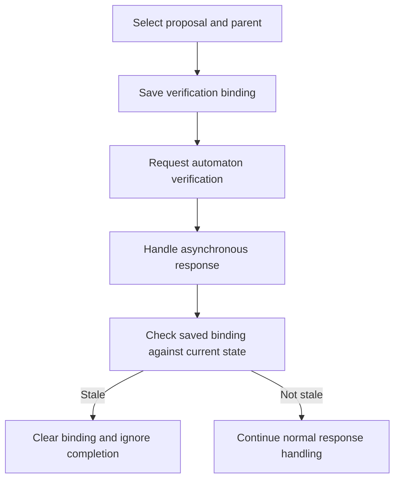

# A Simplex semantic beacon: verification results and stale state

This example follows one developer comment through the Simplex voter and turns it
into a proposed state-coverage probe. It covers finding the beacon, tracing its
state, choosing the observation, writing the instrumentation, and validating it.

Source revision: `f8c45974487b3c0be871616dd538c9e0b8585dab`.
Line numbers below refer to that revision. Instrumentation will move them.

The source files are:

- [round.rs](../../consensus/src/simplex/actors/voter/round.rs): state for one round.
- [state.rs](../../consensus/src/simplex/actors/voter/state.rs): state across rounds.
- [actor.rs](../../consensus/src/simplex/actors/voter/actor.rs): requests and responses.
- [metrics.rs](../../consensus/src/simplex/metrics.rs): timeout-reason variants.
- [StateLens runtime](../runtime/statelens.rs): probe encoding and coverage recording.

A **semantic beacon** is existing evidence that a state relationship matters: a
comment, enum, assertion, design document, or similar artifact. A **probe** is the
instrumentation that records an observation for coverage. This example adds a
probe; it does not derive a new invariant or assert that a stale response is a bug.

Discovery commands below run from the repository root. Apply the proposed Rust
change only in a campaign's prepared, disposable checkout, where the StateLens
runtime has been materialized as `crate::simplex::statelens`. The runtime template
under `statelens/runtime/` alone does not make that module available to consensus.

<!-- statelens-lint: not-code: sl_stale, sl_probe -->

## 1. Find an existing semantic beacon

Ask the syntax-tree tool for comments about requests that are still in flight:

```bash
python3 statelens/scripts/statelens.py ast notes \
  --pattern 'in flight' \
  consensus/src/simplex/actors/voter/round.rs
```

The result points to `round.rs:116`:

```rust
// Proposal and resolved parent payload selected when peer verification
// started. A certificate may replace either while the request is in flight.
verifying: Option<(Proposal<D>, D)>,
```

The comment supplies our starting question:

> When verification finishes, does its saved proposal and parent still match the
> currently selected state?

The comment is the beacon. The field is a candidate state to trace. At this point
we have not chosen a probe or established how the implementation handles a change.

`ast notes` uses `rust-analyzer parse` to identify comments and their associated
items. It does not itself infer the relationship described by the comment.

## 2. Find where the snapshot is written and read

```bash
python3 statelens/scripts/statelens.py ast sites verifying \
  consensus/src/simplex/actors/voter/round.rs
```

At the source revision above, the command reports:

```text
write  consensus/src/simplex/actors/voter/round.rs:219
write  consensus/src/simplex/actors/voter/round.rs:229
maybe  consensus/src/simplex/actors/voter/round.rs:224  .as_ref(..)
init   consensus/src/simplex/actors/voter/round.rs:146
```

Read those sites to determine what each operation means:

| Site | Function | Meaning |
|---|---|---|
| `round.rs:146` | `Round::new` | Starts with no saved verification binding. |
| `round.rs:219` | `Round::set_verifying` | Saves the proposal and parent payload selected for verification. |
| `round.rs:224` | `Round::verifying` | Borrows the saved binding through `Option::as_ref`. |
| `round.rs:229` | `Round::clear_verifying` | Removes the saved binding. |

The important write is:

```rust
self.verifying = Some((proposal, parent_payload));
```

The tool labels the getter as `maybe` because a method call can mutate its receiver.
Reading this particular call establishes that it only borrows the option's contents.
Syntax classification gives candidates; source inspection settles their meaning.

## 3. Follow the callers into the verification lifecycle

SCIP queries identify symbols and their references. The index must cover the
`consensus` crate. Build it for Simplex if it is absent, stale, or describes another
crate:

```bash
python3 statelens/scripts/statelens.py code build --subsystem simplex
```

This build can take several minutes. Then query the three methods:

```bash
python3 statelens/scripts/statelens.py code callers set_verifying
python3 statelens/scripts/statelens.py code callers verifying
python3 statelens/scripts/statelens.py code callers clear_verifying
```

Names can match both a field and a method. Select the getter's symbol when reading
the results for `verifying`, and inspect each candidate call in the source.

During the walkthrough, the saved index covered `storage`, so those queries could
not establish the Simplex callers. The fallback used to verify this example was:

```bash
rg -n 'set_verifying|clear_verifying|\.verifying\(' \
  consensus/src/simplex/actors/voter
```

Reading the resulting sites and their surrounding functions establishes this path:

| Stage | Source | What happens |
|---|---|---|
| Select verification inputs | `state.rs:1044`, `State::try_verify` | Saves the proposal and resolved parent payload before returning `Verify::Ready`. |
| Request verification | `actor.rs:370`, `Actor::try_verify` | Sends the selected context and payload to the automaton and retains its response receiver. |
| Handle the response | `actor.rs:642`, `Actor::process_verified` | Dispatches success to `State::verified`, and rejection or a closed response channel to `State::verification_failed`. |
| Check the binding | `state.rs:1404`, `State::verification_matches` | Reads the saved binding and compares it with the current proposal and resolved parent payload. |
| Discard a stale completion | `state.rs:1077`, `State::verification_is_stale` | Clears a mismatching binding and reports that the response is stale. |



When a binding is present, the comparison checks that a current proposal exists,
that it equals the saved proposal, and that the parent resolves to the saved parent
payload. Missing or different current data makes that binding stale.

There is an important boundary to the interpretation: `verification_matches` also
returns `true` when the round or saved binding is absent. Therefore, a false
staleness flag means the existing check did not reject the completion; it does not
prove that a saved binding existed and matched. The probe will preserve that exact
meaning.

Both successful and failed completions pass through the staleness check. This
example instruments the failure path, where the failure reason is already available
beside the check. Source inspection supplies this connection; StateLens currently
has no native data-flow tool that establishes the entire asynchronous path for us.

## 4. Choose a useful pair of observations

The existing function at `state.rs:1102` is:

```rust
pub fn verification_failed(&mut self, view: View, reason: TimeoutReason) {
    if self.verification_is_stale(view) {
        return;
    }
    self.trigger_timeout(view, reason);
}
```

Choose the pair:

```text
(failure reason, result of the existing staleness check)
```

The current production callers provide two reasons:

| Automaton response | Reason passed to the failure handler | Observations of interest |
|---|---|---|
| Explicit rejection, `Ok(false)` | `TimeoutReason::InvalidProposal` | Stale and not stale |
| Response channel closed, `Err(...)` | `TimeoutReason::IgnoredProposal` | Stale and not stale |

This gives four combinations to investigate. A stale result is a valid observation:
the implementation is expected to ignore it.

Recording only the staleness boolean largely repeats a branch already in the code.
Recording the reason and boolean together preserves their relationship. Edge
coverage can encounter both failure branches and both staleness branches on
different calls without explicitly recording every pairing.

This is a reason to try the probe, not a measured coverage improvement. Compiler
inlining and other existing feedback may already distinguish some combinations.
Validation must establish whether the probe adds useful feedback in the actual
build.

## 5. Encode the values and insert one probe

Use the existing runtime helpers:

- `disc(&reason)` produces an enum-variant code, stable within a build.
- `flag(sl_stale)` produces `0` or `1`.

Count the full encoded domain. `TimeoutReason` has ten variants, even though the
current production callers here use only two. The bound is therefore
`10 * 2 = 20` pairs, within the approximately 64-pair budget for a probe. No view,
digest, timestamp, or replica index becomes a coverage value.

Wrap the original condition as follows. Full runtime paths avoid adding an import:

```rust
pub fn verification_failed(&mut self, view: View, reason: TimeoutReason) {
    // [statelens] beacon:voter.verification.failed
    if {
        // [statelens] beacon:voter.verification.failed
        let sl_stale = self.verification_is_stale(view);

        // [statelens] beacon:voter.verification.failed
        crate::simplex::statelens::sl_probe!(
            self.scheme.me(),
            "voter.verification.failed",
            crate::simplex::statelens::disc(&reason),
            crate::simplex::statelens::flag(sl_stale),
        );

        // [statelens] beacon:voter.verification.failed
        sl_stale
    } {
        return;
    }
    self.trigger_timeout(view, reason);
}
```

The block evaluates to the original condition's boolean. The existing early return
and timeout call continue to depend on that same value.

The one-evaluation rule matters here: `verification_is_stale` can clear the saved
binding. Calling it again just to populate a probe could inspect a different state
and return a different result. The local `sl_stale` retains the original result
without keeping any persistent ghost history.

The first macro argument is the replica's own participant index. The macro applies
the existing Byzantine guard before recording the observation. It is not a
dimension of the coverage pair. Borrowing `reason` for its discriminant leaves the
original value available to the timeout call.

## 6. Understand what reaches the fuzzer

The runtime's probe macro constructs a site identifier from the label and the
source location. It encodes the two values and hashes `(site, a, b)` into the
StateLens counter table. The selected counter is set to `1`.

The table records presence within a fuzz input. Repeating a pair does not increase
its counter, and the table is reset between inputs. The materialized fuzz targets
register the table with libFuzzer so that a newly observed cell can contribute a
coverage feature alongside ordinary coverage.

For this site, the intended observations include:

```text
(InvalidProposal, 0)
(InvalidProposal, 1)
(IgnoredProposal, 0)
(IgnoredProposal, 1)
```

Those are semantic names for the encoded values, not numeric enum codes to hard-code.
Hash collisions can merge observations, including collisions with other sites.
The table does not preserve event order, occurrence counts, or the identity of a
particular view. This probe also combines all causes of staleness into one boolean;
it does not distinguish a changed proposal from an unavailable or changed parent.

## 7. Record the probe in the campaign plan

Add a row under the plan's `## Beacon probes` table:

| Label | Site | a | b | Beacon |
|---|---|---|---|---|
| voter.verification.failed | `consensus/src/simplex/actors/voter/state.rs` `State::verification_failed` | Failure reason, encoded by `disc(&reason)` | Existing staleness result, encoded by `flag(sl_stale)` | Comment on the saved verification binding at `consensus/src/simplex/actors/voter/round.rs:116@f8c45974487b3c0be871616dd538c9e0b8585dab` |

Record these supporting details beside the row:

- Edited expression: the existing staleness call in the failure handler's `if`
  condition is wrapped in a block and evaluated once.
- Persistent ghost state: none; one temporary boolean holds the result.
- Replica identity: `self.scheme.me()`; the macro applies the Byzantine guard.
- Domain: ten reason variants times two boolean values, at most 20 pairs.
- Interpretation: a false staleness flag includes the existing no-binding cases.
- Scope: failure completions only; successful responses are outside this probe.
- Evidence: the state relationship and call sites were checked against the source.
  Coverage benefit and runtime reachability remain to be measured.

## 8. Validate the instrumented checkout

The source trace above was checked during the walkthrough. The Rust change is a
proposed instrumentation snippet. The following are validation steps for a prepared
campaign checkout, not reported results of an instrumented run.

First, run the campaign's supplied compiler check and its normal test gate. For
focused iteration, an existing state test exercises the stale-rejection path:

```bash
just test -p commonware-consensus \
  failed_optimistic_child_verification_ignores_replaced_parent_verdict
```

The materialized StateLens runtime also contains tests for probe recording and the
Byzantine guard:

```bash
just test -p commonware-consensus simplex::statelens::tests
```

Passing those tests establishes only the behavior they exercise. Complete the
validation with these checks in the instrumented checkout:

| Check | Required evidence |
|---|---|
| Preserve the original evaluation | One staleness evaluation per call; the original return or timeout path follows its result. |
| Preserve protocol behavior | Matching baseline and instrumented state-test outcomes, including the existing stale-rejection case. |
| Record the chosen pair | A focused observation at this new site agrees with the reason and staleness result for the same invocation. |
| Honor the guard | A skipped replica contributes no observation; the original handler still executes normally. |
| Exercise the dimensions | Determine which of the four current-caller combinations are reached; do not infer this from the label or enum alone. |
| Add useful feedback | Compare coverage and throughput in matched runs with state feedback enabled and disabled. Report uncertainty and collisions rather than assuming every pair yields a distinct feature. |

A successful test of the runtime helper does not demonstrate that this new site is
reached. Reaching the site does not establish that all four pairs occur. Those are
separate observations to record when validating the candidate.

To lint this document from the repository root, pass its path explicitly because
the requested directory is `statelens/example/`, while the default example lint
searches `statelens/examples/`:

```bash
just --justfile statelens/justfile check-examples \
  example/simplex_verification_beacon.md
```
